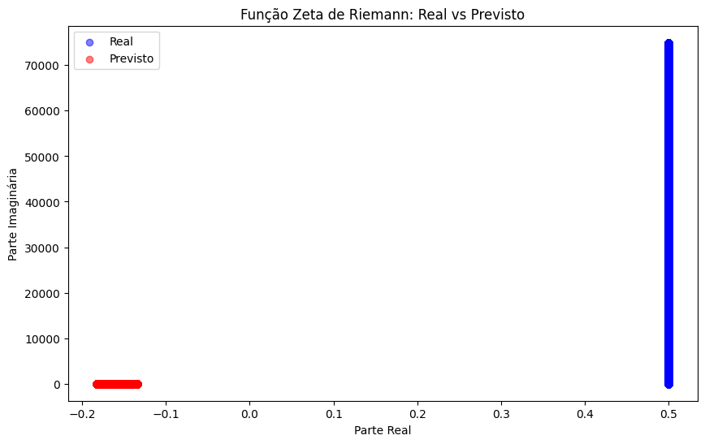

# ZetaNEt
ZetaNet.mojo
ZetaNet.py
ZetaNet.hs

Para implementar uma rede neural para este dataset da função zeta de Riemann, vamos considerar diversos fatores como desempenho, facilidade de uso, ecossistema de bibliotecas e maturidade das ferramentas. Analisarei as opções mais relevantes:

1. Python (com PyTorch ou TensorFlow):
   Python é provavelmente a melhor escolha geral para este projeto de rede neural. Aqui estão as razões:

   - Ecossistema rico: PyTorch e TensorFlow são bibliotecas de aprendizado profundo maduras e poderosas.
   - Facilidade de uso: Python tem uma sintaxe clara e muitos recursos para prototipagem rápida.
   - Ampla comunidade: Há muitos recursos, tutoriais e suporte disponíveis.
   - Integração: Fácil integração com bibliotecas de visualização e análise de dados como matplotlib e pandas.
   - GPU Acceleration: Suporte robusto para computação em GPU, essencial para treinar redes neurais maiores.

2. Mojo:
   Mojo é uma opção interessante, mas tem algumas limitações:

   - Alto desempenho: Potencialmente mais rápido que Python puro para operações numéricas.
   - Compatibilidade com Python: Pode usar bibliotecas Python existentes.
   - Limitações: Sendo uma linguagem nova, pode não ter bibliotecas de aprendizado profundo tão maduras ou otimizadas quanto PyTorch ou TensorFlow.

3. Haskell:
   Haskell é uma opção viável, mas com alguns desafios:

   - Bibliotecas: Existem bibliotecas como HaskTorch, mas não são tão maduras ou amplamente utilizadas quanto as opções em Python.
   - Curva de aprendizado: A programação funcional pode ser desafiadora para quem está acostumado com linguagens imperativas.
   - Desempenho: Pode ser muito eficiente, mas o suporte para GPU e otimizações específicas para deep learning pode não ser tão robusto.

1. J. P. Gram (1903):
Contribuição: Um dos primeiros matemáticos a calcular zeros não triviais da função zeta. Ele calculou cerca de 15 zeros da função.
2. G. H. Hardy e John Edensor Littlewood (1914):
Contribuição: Estabeleceram rigorosamente a existência de infinitos zeros não triviais na linha crítica.
3. Alan Turing (1953):
Contribuição: Desenvolveu um método para verificar zeros da função zeta, que foi utilizado para calcular os primeiros 1.104 zeros não triviais.
4. E. C. Titchmarsh (1950s-1960s):
Contribuição: Realizou cálculos numéricos detalhados, verificando os primeiros 15.000 zeros não triviais.
5. Niels Bohr Institute (1956):
Contribuição: Computou cerca de 30.000 zeros não triviais.
6. Mathematica Computation Group (1970s-1980s):
Contribuição: Com o advento dos computadores, foram calculados milhões de zeros não triviais. Uma equipe liderada por Hugh Montgomery e Andrew Odlyzko na AT&T Bell Laboratories calculou 100 milhões de zeros e confirmou que eles estavam na linha crítica.
7. Andrew Odlyzko (1980s-1990s):
Contribuição: Odlyzko é um dos matemáticos mais conhecidos por seu trabalho na computação dos zeros da função zeta. Em seus trabalhos, ele computou bilhões de zeros não triviais, chegando até o 10^20-ésimo zero.

Os arquivos mencionados no site de Andrew Odlyzko contêm dados detalhados sobre os zeros da função zeta de Riemann, um conceito fundamental na teoria dos números e crucial para a famosa Hipótese de Riemann. Aqui está uma explicação sobre o que cada arquivo representa:

1. **Os primeiros 100.000 zeros da função zeta de Riemann, com precisão de 3*10^(-9):**
   - Este arquivo contém os primeiros 100.000 zeros não triviais da função zeta de Riemann. A precisão dos valores é de até 3 bilhões de casas decimais, o que significa que esses números foram calculados com altíssima exatidão. Esses zeros são fundamentais para estudos analíticos e experimentos numéricos relacionados à Hipótese de Riemann.

2. **Os primeiros 100 zeros da função zeta de Riemann, com precisão superior a 1000 casas decimais:**
   - Este arquivo oferece os valores dos primeiros 100 zeros, mas com uma precisão extraordinariamente alta, ultrapassando 1000 casas decimais. Esse nível de detalhe é utilizado para pesquisas que exigem uma precisão extrema, como em certos testes rigorosos da hipótese ou em cálculos relacionados à distribuição de zeros.

3. **Zeros número 10^12+1 a 10^12+10^4 da função zeta de Riemann:**
   - Aqui, os zeros listados são aqueles que começam no número 10^12+1 e vão até 10^12+10^4. Esses números estão muito distantes dos primeiros zeros e são importantes para entender como os zeros se comportam em regiões mais altas da linha crítica.

4. **Zeros número 10^21+1 a 10^21+10^4 e Zeros número 10^22+1 a 10^22+10^4:**
   - Esses arquivos seguem a mesma lógica do anterior, mas para zeros ainda mais altos, a partir de 10^21 e 10^22 respectivamente. Eles são usados em estudos avançados que tentam identificar padrões ou irregularidades em zeros muito distantes.

5. **Os primeiros 2,001,052 zeros da função zeta de Riemann, com precisão de 4*10^(-9):**
   - Este é um arquivo extenso que lista os primeiros 2.001.052 zeros da função zeta, com uma precisão ligeiramente inferior à do primeiro arquivo (4 bilhões de casas decimais). No entanto, ainda oferece uma base de dados extremamente útil para estudos de larga escala.

Esses arquivos são usados principalmente por matemáticos e pesquisadores que trabalham na análise dos zeros da função zeta, buscando entender melhor a distribuição desses zeros e, em última instância, testar a Hipótese de Riemann.

Você pode acessar esses arquivos e explorar mais detalhes diretamente na [página de Andrew Odlyzko](https://www-users.cse.umn.edu/~odlyzko/zeta_tables/index.html).

Andrew Odlyzko: Tabelas de zeros da função zeta de Riemann

Os primeiros 100.000 zeros da função zeta de Riemann, com precisão de 3*10^(-9). [texto, 1,8 MB] [texto compactado, 730 KB]
Os primeiros 100 zeros da função zeta de Riemann, com precisão de mais de 1000 casas decimais. [texto]
Número zero de 10^12+1 a 10^12+10^4 da função zeta de Riemann. [texto]
Número zero de 10^21+1 a 10^21+10^4 da função zeta de Riemann. [texto]
Número zero de 10^22+1 a 10^22+10^4 da função zeta de Riemann. [texto]
